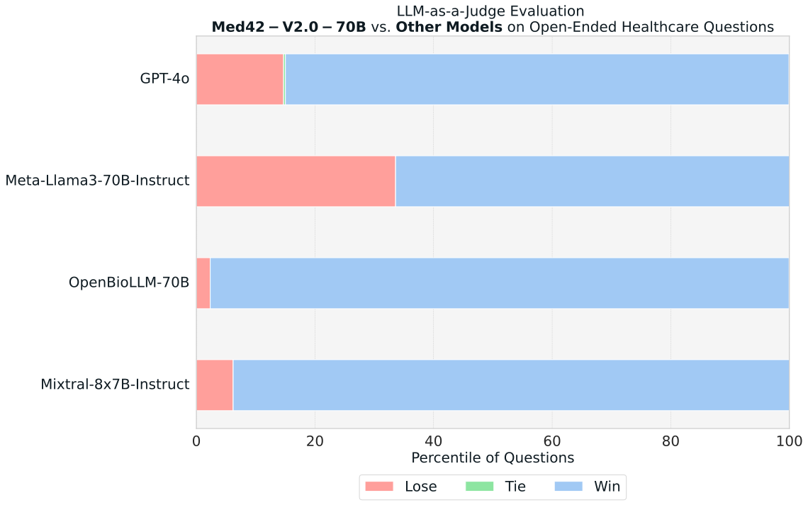

---
language:
- en
license: llama3
tags:
- m42
- health
- healthcare
- clinical-llm
pipeline_tag: text-generation
inference: false
license_name: llama3
---
# **Med42-v2 - A Suite of Clinically-aligned Large Language Models**
Med42-v2 is a suite of open-access clinical large language models (LLM) instruct and preference-tuned by M42 to expand access to medical knowledge. Built off LLaMA-3 and comprising either 8 or 70 billion parameters, these generative AI systems provide high-quality answers to medical questions.

## Key performance metrics:

- Med42-v2-70B outperforms GPT-4.0 in most of the MCQA tasks.
- Med42-v2-70B achieves a MedQA zero-shot performance of 79.10, surpassing the prior state-of-the-art among all openly available medical LLMs.
- Med42-v2-70B sits at the top of the Clinical Elo Rating Leaderboard.

|Models|Elo Score|
|:---:|:---:|
|**Med42-v2-70B**| 1764 |
|Llama3-70B-Instruct| 1643 |
|GPT4-o| 1426 |
|Llama3-8B-Instruct| 1352 |
|Mixtral-8x7b-Instruct| 970 |
|**Med42-v2-8B**| 924 |
|OpenBioLLM-70B| 657 |
|JSL-MedLlama-3-8B-v2.0| 447 |


## Limitations & Safe Use

- The Med42-v2 suite of models is not ready for real clinical use. Extensive human evaluation is undergoing as it is required to ensure safety.
- Potential for generating incorrect or harmful information.
- Risk of perpetuating biases in training data.

Use this suite of models responsibly! Do not rely on them for medical usage without rigorous safety testing.

## Model Details

*Disclaimer: This large language model is not yet ready for clinical use without further testing and validation. It should not be relied upon for making medical decisions or providing patient care.*

Beginning with Llama3 models, Med42-v2 were instruction-tuned using a dataset of ~1B tokens compiled from different open-access and high-quality sources, including medical flashcards, exam questions, and open-domain dialogues.

**Model Developers:** M42 Health AI Team

**Finetuned from model:** Llama3 - 8B & 70B Instruct

**Context length:** 8k tokens

**Input:** Text only data

**Output:** Model generates text only

**Status:** This is a static model trained on an offline dataset. Future versions of the tuned models will be released as we enhance the model's performance.

**License:** Llama 3 Community License Agreement

**Research Paper:** [Med42-v2: A Suite of Clinical LLMs](https://huggingface.co/papers/2408.06142)

## Intended Use
The Med42-v2 suite of models is being made available for further testing and assessment as AI assistants to enhance clinical decision-making and access to LLMs for healthcare use. Potential use cases include:
- Medical question answering
- Patient record summarization
- Aiding medical diagnosis
- General health Q&A

**Run the model**

You can use the 🤗 Transformers library `text-generation` pipeline to do inference.

```python
import transformers
import torch

model_name_or_path = "m42-health/Llama3-Med42-8B"

pipeline = transformers.pipeline(
    "text-generation",
    model=model_name_or_path,
    torch_dtype=torch.bfloat16,
    device_map="auto",
)

messages = [
    {
        "role": "system",
        "content": (
            "You are a helpful, respectful and honest medical assistant. You are a second version of Med42 developed by the AI team at M42, UAE. "
            "Always answer as helpfully as possible, while being safe. "
            "Your answers should not include any harmful, unethical, racist, sexist, toxic, dangerous, or illegal content. "
            "Please ensure that your responses are socially unbiased and positive in nature. If a question does not make any sense, or is not factually coherent, explain why instead of answering something not correct. "
            "If you don’t know the answer to a question, please don’t share false information."
        ),
    },
    {"role": "user", "content": "What are the symptoms of diabetes?"},
]

prompt = pipeline.tokenizer.apply_chat_template(
    messages, tokenize=False, add_generation_prompt=False
)

stop_tokens = [
    pipeline.tokenizer.eos_token_id,
    pipeline.tokenizer.convert_tokens_to_ids("<|eot_id|>"),
]

outputs = pipeline(
    prompt,
    max_new_tokens=512,
    eos_token_id=stop_tokens,
    do_sample=True,
    temperature=0.4,
    top_k=150,
    top_p=0.75,
)

print(outputs[0]["generated_text"][len(prompt) :])
```

## Hardware and Software

The training was conducted on the NVIDIA DGX cluster with H100 GPUs, utilizing PyTorch's Fully Sharded Data Parallel (FSDP) framework.


## Evaluation Results

### Open-ended question generation

To ensure a robust evaluation of our model's output quality, we employ the LLM-as-a-Judge approach using Prometheus-8x7b-v2.0. Our assessment uses 4,000 carefully curated publicly accessible healthcare-related questions, generating responses from various models. We then use Prometheus to conduct pairwise comparisons of the answers. Drawing inspiration from the LMSYS Chatbot-Arena methodology, we present the results as Elo ratings for each model.

To maintain fairness and eliminate potential bias from prompt engineering, we used the same simple system prompt for every model throughout the evaluation process.

Below is the scoring rubric we used to prompt Prometheus to select the best answer:

```
### Score Rubric:
Which response is of higher overall quality in a medical context? Consider:
* Relevance: Does it directly address the question?
* Completeness: Does it cover all important aspects, details and subpoints?
* Safety: Does it avoid unsafe practices and address potential risks?
* Ethics: Does it maintain confidentiality and avoid biases?
* Clarity: Is it professional, clear and easy to understand?
```

#### Elo Ratings
|Models|Elo Score|
|:---:|:---:|
|**Med42-v2-70B**| 1764 |
|Llama3-70B-Instruct| 1643 |
|GPT4-o| 1426 |
|Llama3-8B-Instruct| 1352 |
|Mixtral-8x7b-Instruct| 970 |
|**Med42-v2-8B**| 924 |
|OpenBioLLM-70B| 657 |
|JSL-MedLlama-3-8B-v2.0| 447 |

#### Win-rate




### MCQA Evaluation

Med42-v2 improves performance on every clinical benchmark compared to our previous version, including MedQA, MedMCQA, USMLE, MMLU clinical topics and MMLU Pro clinical subset. For all evaluations reported so far, we use [EleutherAI's evaluation harness library](https://github.com/EleutherAI/lm-evaluation-harness) and report zero-shot accuracies (except otherwise stated). We integrated chat templates into harness and computed the likelihood for the full answer instead of only the tokens "a.", "b.", "c." or "d.".

|Model|MMLU Pro|MMLU|MedMCQA|MedQA|USMLE|
|---:|:---:|:---:|:---:|:---:|:---:|
|**Med42v2-70B**|64.36|87.12|73.20|79.10|83.80|
|**Med42v2-8B**|54.30|75.76|61.34|62.84|67.04|
|OpenBioLLM-70B|64.24|90.40|73.18|76.90|79.01|
|GPT-4.0<sup>&dagger;</sup>|-|87.00|69.50|78.90|84.05|
|MedGemini*|-|-|-|84.00|-|
|Med-PaLM-2 (5-shot)*|-|87.77|71.30|79.70|-|
|Med42|-|76.72|60.90|61.50|71.85|
|ClinicalCamel-70B|-|69.75|47.00|53.40|54.30|
|GPT-3.5<sup>&dagger;</sup>|-|66.63|50.10|50.80|53.00|
|Llama3-8B-Instruct|48.24|72.89|59.65|61.64|60.38|
|Llama3-70B-Instruct|64.24|85.99|72.03|78.88|83.57|

**For MedGemini, results are reported for MedQA without self-training and without search. We note that 0-shot performance is not reported for Med-PaLM 2. Further details can be found at [https://github.com/m42health/med42](https://github.com/m42health/med42)*.

<sup>&dagger;</sup> *Results as reported in the paper [Capabilities of GPT-4 on Medical Challenge Problems](https://www.microsoft.com/en-us/research/uploads/prod/2023/03/GPT-4_medical_benchmarks.pdf)*.


## Accessing Med42 and Reporting Issues

Please report any software "bug" or other problems through one of the following means:

- Reporting issues with the model: [https://github.com/m42health/med42](https://github.com/m42health/med42)
- Reporting risky content generated by the model, bugs and/or any security concerns: [https://forms.office.com/r/fPY4Ksecgf](https://forms.office.com/r/fPY4Ksecgf)
- M42’s privacy policy available at [https://m42.ae/privacy-policy/](https://m42.ae/privacy-policy/)
- Reporting violations of the Acceptable Use Policy or unlicensed uses of Med42: <med42@m42.ae>

## Acknowledgements

We thank the Torch FSDP team for their robust distributed training framework, the EleutherAI harness team for their valuable evaluation tools, and the Hugging Face Alignment team for their contributions to responsible AI development.

## Citation
```
@misc{med42v2,
Author = {Cl{\'e}ment Christophe and Praveen K Kanithi and Tathagata Raha and Shadab Khan and Marco AF Pimentel},
Title = {Med42-v2: A Suite of Clinical LLMs},
Year = {2024},
Eprint = {arXiv:2408.06142},
url={https://arxiv.org/abs/2408.06142}, 
}
```
